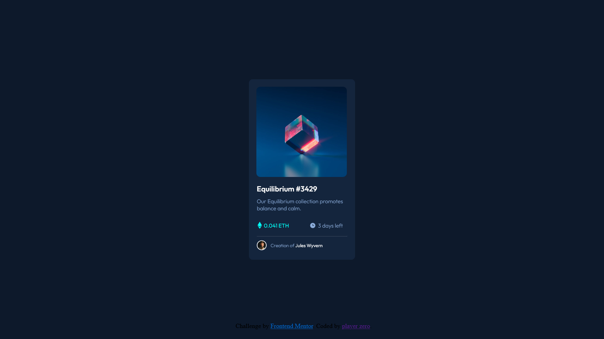
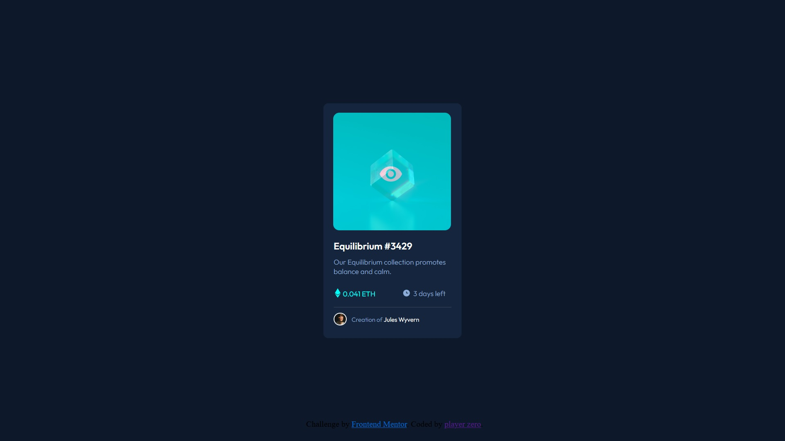

# Frontend Mentor - NFT preview card component solution

This is a solution to the [NFT preview card component challenge on Frontend Mentor](https://www.frontendmentor.io/challenges/nft-preview-card-component-SbdUL_w0U).

## Table of Contents

- [Overview](#overview)
- [Challenges](#challenges)
- [Lessons](#lessons)
- [Author](#author)

## Overview

Just a simple NFT card. Trying to make it exactly like the challenge itself

## Challenges

The eye is not fully visible. Layer problem, tried to mess with div tags.

## Lessons

got it working, learned about the rgba

r = red
g = green
b = blue
a alpha (transparency)

that is a key highlight which solves the problem

## Author

[player zero-ui](https://github.com/playerzer0-ui)